# Summary
In this workshop, we introduce ways to improve your computational reproducibility through version control. We cover the basic principles of reproducible computer-based analyses as well as how to use version control tools in [git](https://git-scm.com/) and [GitHub](https://github.com/).

At the end of this workshop, you will be able to:

* Describe the uses and importance of computational reproducibility
* Define version control
* Use Git to version control a text file on your computer
* Use GitHub to share and collaborate on version controlled files

# Before you arrive
This workshop assumes no prior experience. However, you will need to complete the following steps prior to the workshop.

* Download and install git on your [Mac/Linux](https://git-scm.com/downloads) or [Windows](https://gitforwindows.org/) computer
* Create a [GitHub account](https://github.com/join?source=header-home)
* Download and install [GitHub Desktop](https://desktop.github.com/)
* _Hawn and Altman labs only_: Send your GitHub username to Kim <kadm@uw.edu> to be added to the [Hawn](https://github.com/hawn-lab) or [Altman](https://github.com/altman-lab) lab organization

# Introduction
## Reproducibility > Replicability > Repeatability
Reproducibility is purported to be at the heart of science. But what do we mean when we say "reproducible research"? In general, researchers think of themselves or others repeating an experiment from a published paper and obtaining the same result. However, this is actually **repeatability, to exactly replicate the experiment**, with **replicability, to exactly replicate the experiment AND its result(s)**.

What we should actually strive for is true **reproduciblity, to reach the same conclusions through different methods**. That said, it is much easier to achieve reproduciblity when the methods being compared are repeatable and replicable.

In addition, researchers usually think of the reproducibility of wet lab experiments. It is a somewhat newer movement for researchers to try to make analysis and computational methods reproducible. In this workshop, we will cover one method to improve your computational *replicability*: version control.

## What is version control?
Version control is any means of recording changes to file(s) over time so that you can recall or revert back to specific versions later.

One method of version control you may have employed in the past is dated or versioned file names like `myFile_2018.06.25.txt` or `myFile_v1.2.txt`. While these systems can get the job done, you end up will a long list of files that take up storage space and have little information on how they differ. It remains up to you to remember or tell someone what date or version to go back to for whatever purpose is needed. 

And heaven forbid you stamp a file with `final`!

{width=50%}
\ 

## Why Git?

There is a better way to version control with distributed systems, and [Git](https://git-scm.com/) is one such language/program. While Git can be used to track changes for any file type, it is most useful with text-based files like `.txt`, `.csv`, `.R`, etc. because these are *source files* with the appearance directions clearly noted and not hidden behind a graphical user interface (GUI). Think of Git like the "track changes" feature of MS Word, except there is a record of the changes after you "accept" them.

The advantages of distributed version control over naming methods are below. Unfortunately, we will not be able to cover all of these features in this workshop.

- it is easy to see what changed when (time-stamped), why (commented), and by whom (author identified)
- you can jump back to any point in time since the file's creation, not just versions you deemed important enough to save at the time
- you have the freedom to experiment, try something crazy even, because you can always go back to the last known good version
- you can work on 2+ different versions in parallel
- you are able manage contributions from multiple people

Specifically, we are using Git, as opposed to another program, because it:

- is very fast, even for projects with hundreds of files and years of history
- is already extremely popular

# Using Git and GitHub
Git, itself, is a command line program. Thus, all Git functions can be accessed from the command line with `git` followed by the function name like `git status` (see example below).

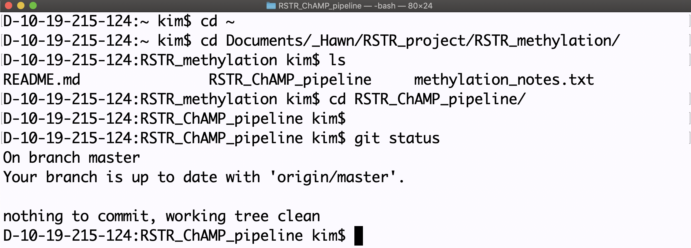{width=50%}
\ 

However, git gains much of its usefulness from [GitHub](https://github.com/), a web service for hosting Git repositories containing all your content and version history. GitHub has both command line and GUI versions. To make this workshop readily accessible to all users, we will jump right into a GUI version called [GitHub Desktop](https://desktop.github.com/). If you would like to learn more about command line git, checkout this [Reproducible Research workshop](https://github.com/EDUCE-UBC/workshops_R/tree/master/reproducible_research).

## Link your account
To start, open your installed GitHub Desktop. You should see the following options.

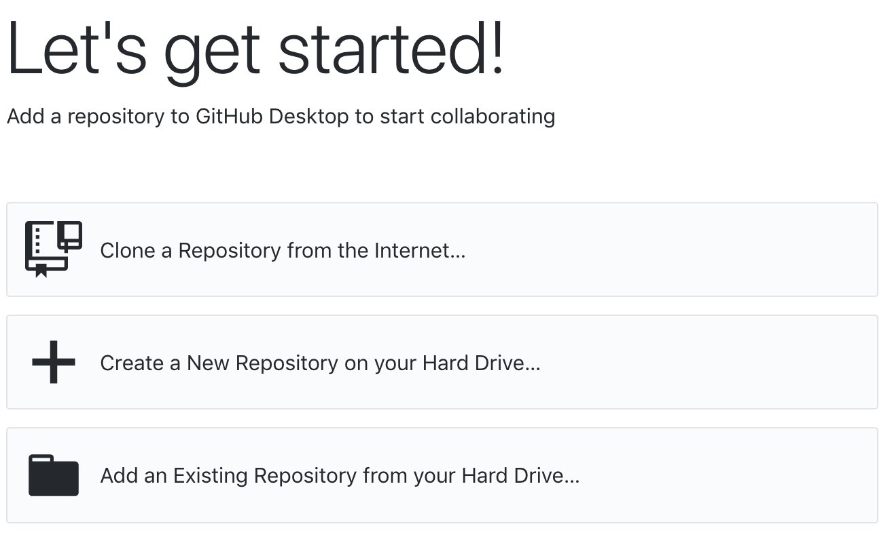{width=50%}
\

Before we select one of these options, however, we will first setup your account.

Under `GitHub Desktop > Preferences > Accounts`, please sign into your GitHub account and [Save]. If you already have repos on GitHub, as I do, your starting screen will update like so.

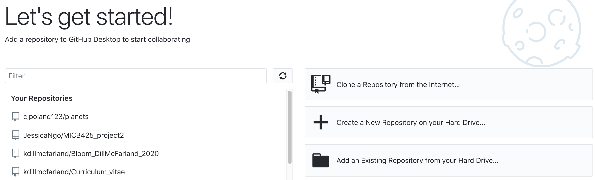{width=100%}
\

Now, going to `GitHub Desktop > Preferences > Git`, you should see that GitHub has automatically generated a name and email for you. This is based on your GitHub account and is the info included in all the interactions you have with git and GitHub. Please update if you wish.

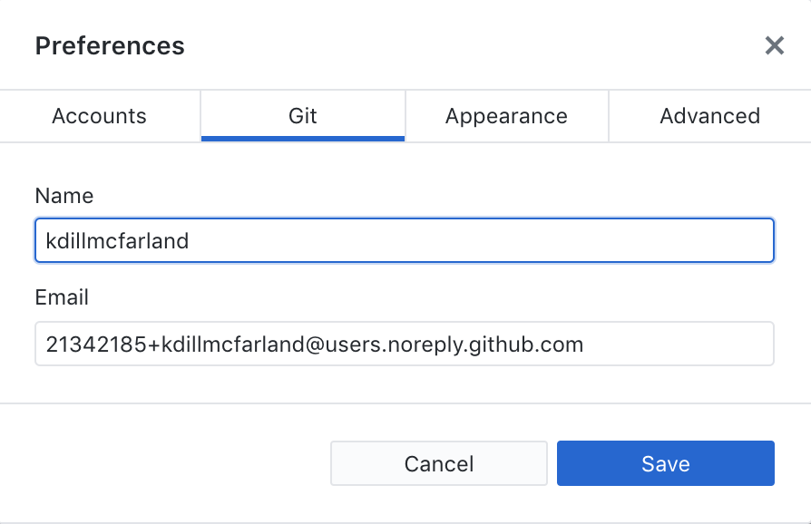{width=50%}
\

## Initialize (init) a repo
Git will not implement version control on your files until you tell it to do so. Thus, it is possible (and very common) to have version controlled directories on your computer right alongside non-version controlled ones. You tell git to start version controlling a set of files by initializing a repository. **A repository (repo) is a version-controlled directory and all of its contents, including the version history.** 

To get started in GitHub Desktop, we are given the following options:

* Clone a repo: this is if you already have a repository on your GitHub and want to clone (*i.e.* copy) that content (including version control) to your current computer
* Create a new repo: this creates a directory and tells git that you want to version control files in that directory
* Add an existing repo: this is if you are already using command line git and have a version-controlled folder you want to now link to your GitHub

Since not everyone has a repo on their computer and/or on GitHub, we will `+ Create a new repo` using the second option on the start screen.

Input the name as `TestRepo`, select "Initialize this repository with a README", and select a "Local Path" to wherever on your computer you would like this directory saved. Then select [Create Repository].

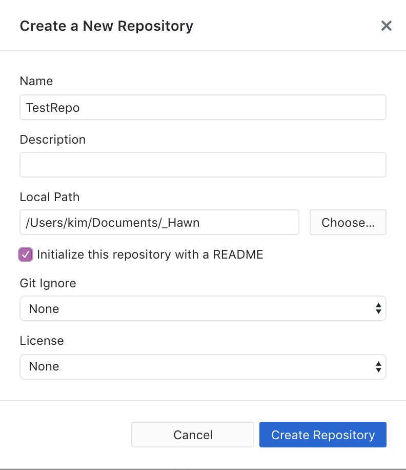{width=50%}
\

If you navigate in your file explorer to where you saved `TestRepo`, you should see a new folder containing the file `README.md`. 

## Save (add/commit) changes
By creating a repo with a README already in it, git has already enacted version control on the `README.md` file. This is done by adding the file to the list of tracked files and then committing the changes as a saved version. 

If you go to the "History" tab on the left, you will see this "Initial commit". Notice that two files were added (indicated by green +). The `README.md` is expected but also notice `.gitattributes`. Since this files starts with a `.`, you will not see it in your normal file explorer but git uses it to keep track of which files are version controlled in the directory.

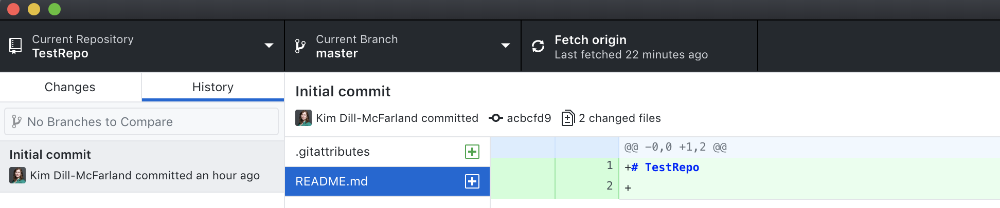{width=100%}
\

#### Git staging area (index)
In traditional command line git, `add` and `commit` are two separate steps that pass through the index (see below). The index (also called the staging area) is where a version of a file is stored prior to it being more permanently saved as a committed version.

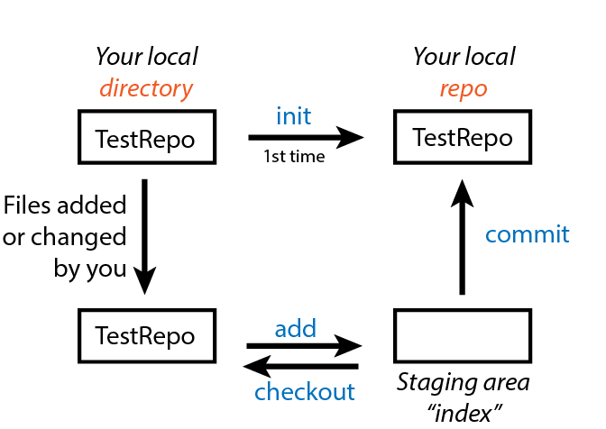{width=50%}
\

This is useful because sometimes you may want to:

* save a version as a back-up in the short-term but do not want to permanently save that version in the long-term
* complete many small changes separately but save them all together as 1 new version
* compare your current version with the last committed version without causing any conflicts in your repo

In the GUI, however, both steps are completed at the same time and instead, back on the "Changes" tab, you will see an [Undo] button at the bottom that can serve the same purpose as using an index.

## Upload (push) to GitHub 
At this point, this repo is initialized with git version control *but is not yet uploaded to GitHub*. 

You upload (or push) by selecting [Publish repository] in the upper right. If you're part of a GitHub organization, you can upload to the organization instead of your personal account. Also if you or an organization you're part of has private repo features, you can choose to keep the repo private or not. 

Here, let's keep the repo public and in our own accounts.

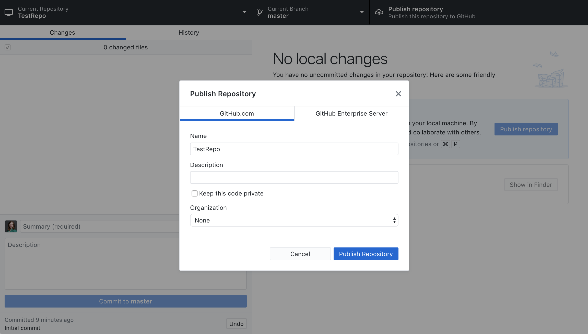{width=100%}
\

Now the repo should appear on your GitHub

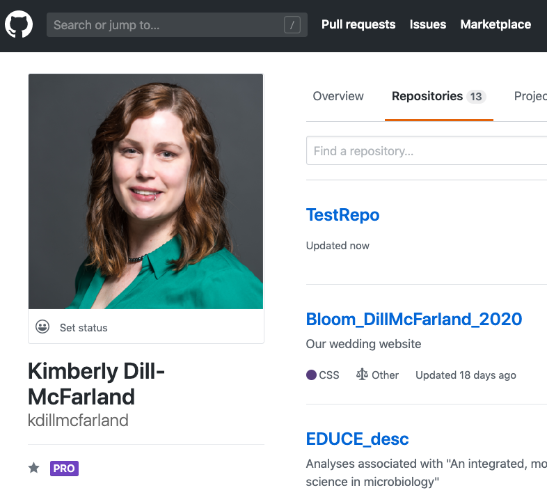{width=50%}

And we can expand our Git diagram to include GitHub. Similar to the git index, GitHub also uses an index, which you will use in the following exercise.

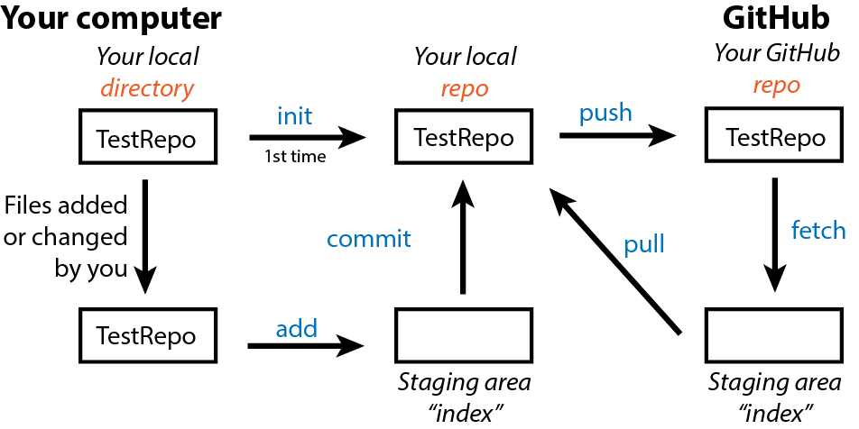
\ 

## Exercise: add, commit, push

1. Change a file on your computer and push to GitHub
  - Add the following to your `README.md` file, where you fill in your name. You can open a `.md` file with any text editor.
    ```
  My name is Kim Dill-McFarland.  
    ```
  - Use GitHub Desktop to commit this change and push to GitHub. Make sure to include a description! These are **extremely important** as they tell you how the new version differs from the old. Without descriptions, your GitHub will only be as informative as dated files.
2. Change a file on GitHub and pull to your computer
  - Refresh your GitHub page online and navigate to the `README.md` file. Select the pencil icon on the right to edit the file
  - Add your favorite color, and commit the change on GitHub
  - Back in the Desktop GUI, review the repo's history tab. Is the README updated on your computer? Why or why not?
  - What step(s) do you need to complete to update `README.md` on your computer with the one on GitHub? Once identified, complete these steps.
  
# Collaborate with GitHub
So far, you've learned to version control a file using git and share that file on GitHub. But what if you switch computers? Or what if multiple people need to work on files in the same repo? This is where many of GitHub's online tools come in.

## Copy (clone) a repo
If you are the only one working on your repo and only work on it from 1 computer, then GitHub acts as a one-way street. You push things there for storage, sharing, etc. and should only need to pull them back down if something terrible happens to your computer. However, GitHub also allows work on a repo from multiple computers and by multiple different users. 

If it is just you working on a repo but you use multiple computers, the best method is to setup git/GitHub and clone (*i.e.* copy) your repo onto the second computer. Every time you end a session, remember to commit and push that repo to GitHub and then when you start a new session on another computer, fetch and pull before beginning again.

You can find the clone function under the File menu in your Desktop GUI. The GitHub.com tab lists all repos associated with your accounts and organizations.

## Fork a repo
If, instead, there are multiple people working on the same repo, then it is NOT best practices to all clone and try to push changes to it. This will cause *a lot* of conflicts and version issues. 

In this case, collaborators need to fork the repo. This clones the repo into your account and you can commit/push all you want without impacting the original owner's copy. Then, when you've accomplished your task, you submit a pull request asking the repo owner to merge their version with your updated version. The original repo owner can then decide to take some, all, or none of your changes.

(Of note, if you want to fork your own repo, this is called a branch and is a different process that we do not have time to go over). 

To begin your first GitHub collaboration, fork my `TestCollab` repo at <https://github.com/kdillmcfarland/TestCollab>. In the Desktop GUI, clone your fork copy to your compuater, make a change in `README.md`, and commit + push this change.

Once you've committed the change, navigate to the "Pull requests" tab on your GitHub fork of `TestCollab`. Importantly, you should see "yourUsername/TestCollab forked from kdillmcfarland/TestCollab" in the upper left. 

**If your last name starts with N-Z**, create a "New pull request" now.

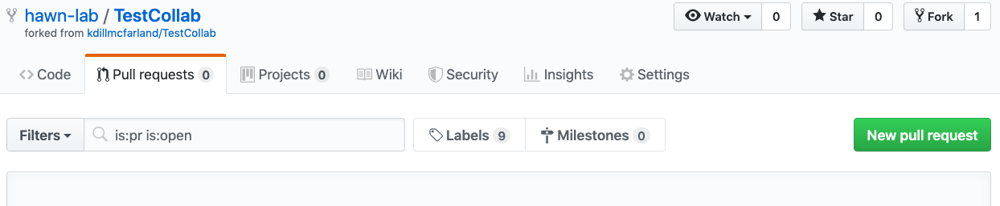

### No-conflict pull request (N-Z)
If none of your changes conflict with the owner's version (*e.g.* they haven't changed their version since you forked it or you didn't happen to change any of the same lines as they did since then), you will be told that the fork can be merged with the original copy. And the owner (in this case me) will be given a simple pull request that they can merge right away!

<br>

#### You see

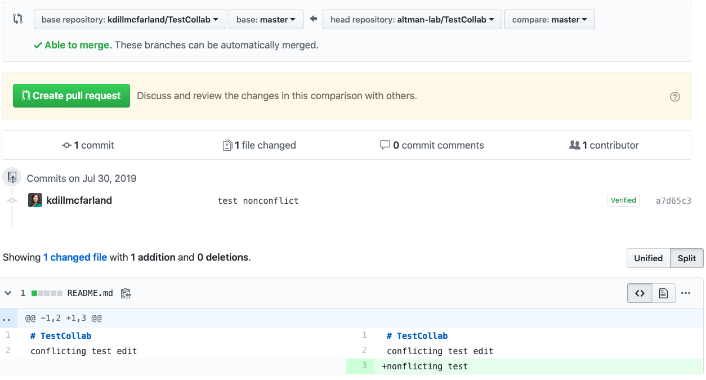

<br>

#### Repo's owner sees

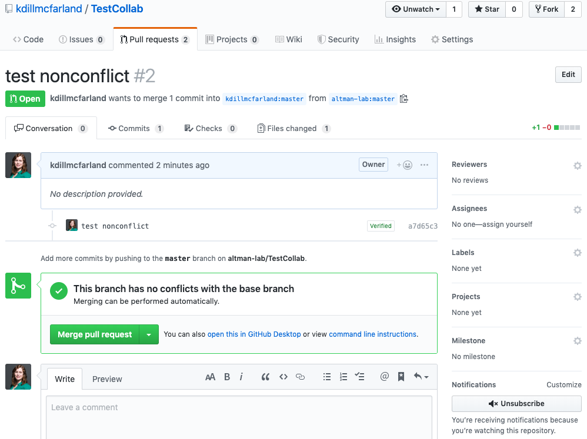

<br>

#### After merging the fork

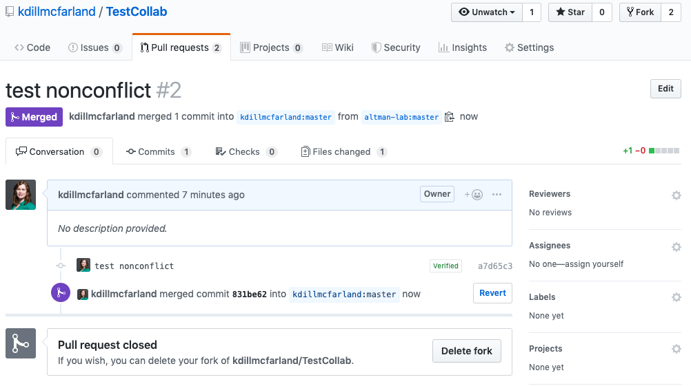

<br>

### Conflict pull request (A-M)

**If your last name starts with A-M**, create a "New pull request" now (after I have merged `TestCollab` with the first group's edits).

Alternatively, if your edits cannot be simply merged due to conflicts, you will be warned but should still continue with the pull request. It is then up to the original repo owner to review your changes and resolve any conflicts. There is also a chat feature here so that the owner can ask for further input or changes to the fork from you or others on GitHub.

<br>

#### You see

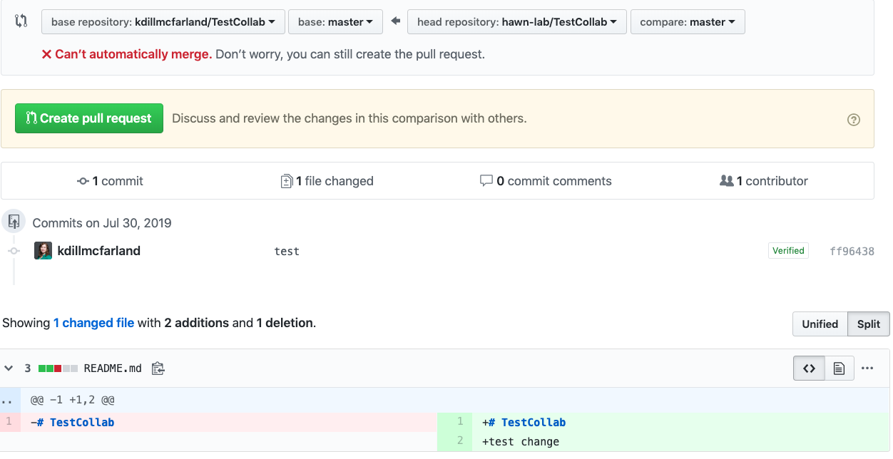

<br>

#### Repo's owner sees

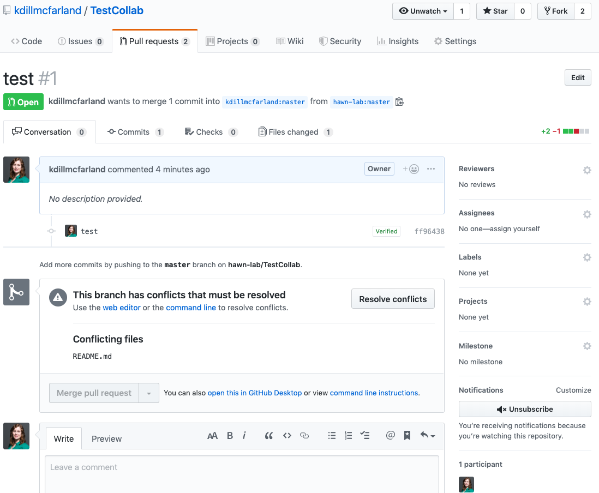

<br>

#### Resolving conflicts
If you find yourself with a git conflict, either in a branch, a fork, or just between your GitHub and local copies, git will mark the conflicts with `<<<<<<<` like so

```
Text that has no conflicts.
<<<<<<< master
Text that has a conflict. Whatever is here is the version in the fork/branch that wants to merge with the master
=======
Text that has a conflict. Whatever is here is the version in the master (original) branch/fork
>>>>>>> master
More non-conflict text.
```
For a fork, you select [Resolve conflicts] and are taken to an editor to make corrections. Simply correct the text in between the `<<<<<<<` and remove the `<`, `=`, and `>` lines. Then, mark the conflict as resolved and commit your changes. This will return you to the pull request page where you can now "Merge pull request".

All together this creates a version history like below.

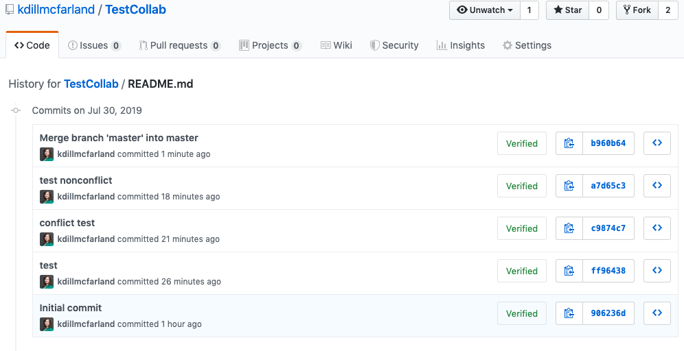

## Maintaining a fork
Importantly, after your pull request is accepted (or not), you retain your forked copy of the repo. Thus, you can continue to make changes and submit later pull requests as needed.

Before embarking on a new task in the repo, make sure your fork is up-to-date with the original master copy. You can see below that after completing the merges in this workshop, the Altman fork of `TestCollab` is 4 commits behind!


So, you select [Pull request] and create one from the original copy to your fork (the opposite of what we did before). There is *hopefully* a simple button coming soon but currently, this means you have to change the base <- head repository names here.

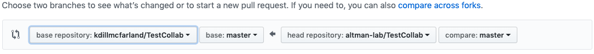

1. Change the base repo to your fork
2. Click [compare across forks] because making the base one of your own repos makes GitHub think you're looking at a branch, not a fork
3. Change the head repo to the original master copy
4. Create and merge pull request as before.
    - You may have to deal with conflicts again.

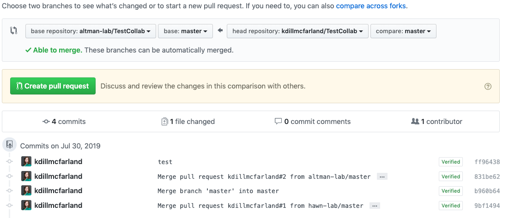

## GitHub issues
If you're not a close collaborator of the owner or not confident enough in your coding skills to fork a repo and attempt edits yourself, there are also GitHub issues. These allow any user to post a comment, edit, feature request, etc. to any public repo on GitHub. They are a great way to get involved and developers love knowing what is and is not working! For example, here is a list of issues for Software Carpentries "Introduction to git" lesson!

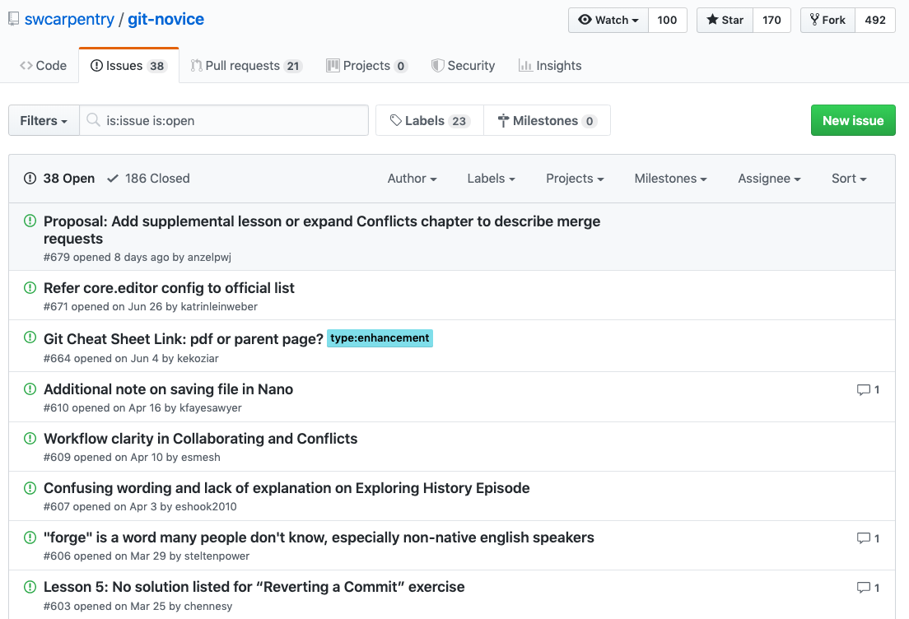

## Exercise: forks

1. In pairs, collaborate in your TestRepo
  - Person A: Fork your partner's TestRepo and make a change in their `README.md`. Commit and send a pull request.
  - Person B: Make a change in your `README.md` and commit + push after your partner makes a fork but before they submit their pull request.
  - Switch roles so that each of you have a pull request with conflicts to resolve
  - Together: Work to resolve your conflicts and commit + push a final version of your original `TestRepo`
  
# GitHub limitations
While git and GitHub are powerful tools, there are several limitations to keep in mind.

* GitHub has unlimited storage but each individual file must be $\leq$ 100MB
    - You can compress/zip files to try to get around this, but GitHub was originally designed for code collaboration so it is not setup to share/store large data files
* Git can only gives detailed change history for source files
    - You can still version control .doc, .pdf, .jpeg, etc. files and have the ability to go back to old versions. However, GitHub cannot show you line-by-line, color-coded changes as we saw with our `README.md`. Thus, make sure your commit descriptions are detailed!
* Not everyone has private repos and public repos are 100% public
    - You may not want to share your working code with the world (though knowing someone else can see it is a very good motivator to keep nice, commented code). Thus, there are private GitHub repos that only you and those you approve can see. This is a paid Pro feature on GitHub but anyone involved in academic research or teaching can get a FREE Pro account. Enroll as "faculty" at <https://education.github.com/benefits>.
    - The Hawn and Altman GitHub organizations are already registered so once added, you can have private repos within the organization.

# Additional resources
#### Reproducible research
- [Software Carpentry](https://software-carpentry.org/lessons/) including lessons on Git, Rmarkdown, and reproducible research
- [Riffomonas](http://www.riffomonas.org/) including reproducible research methods in R

#### Git/GitHub
- [Git cheatsheet](https://gist.github.com/davfre/8313299)
- [List of all Git commands](https://git-scm.com/docs)
- [Git tutorial](https://git-scm.com/docs/gittutorial)
- [Git Pro EBook](https://git-scm.com/book/en/v2)
- [Git help](https://help.github.com/)
- [Build a web site from a repo!](https://pages.github.com/)
- Explore [private repositories](https://github.com/pricing) and [organizations](https://help.github.com/articles/about-organizations/)