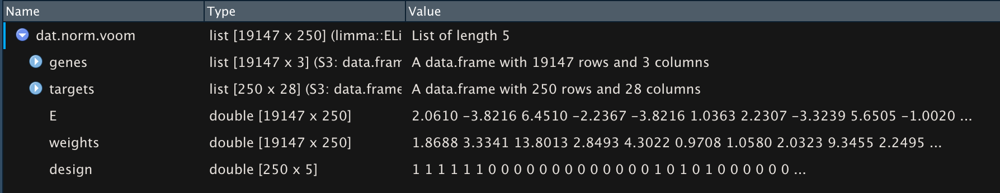

# Overview
In this workshop, we introduce you to R and RStudio at the beginner level as well as begin to work in the tidyverse. In it, we cover:

* R and RStudio including projects, scripts, and packages
* The help function
* Reading in data as a data frame and RData
* Data types
* Manipulating data within the `tidyverse`
* Running multiple linear models with `lm`

We will do all of our work in [RStudio](https://www.rstudio.com/). RStudio is an integrated development and analysis environment for R that brings a number of conveniences over using R in a terminal or other editing environments.

During the workshop, we will build an R script together, which will be posted as 'live_notes' after the workshop [here](https://github.com/hawn-lab/workshops_UW_Seattle/tree/master/2020.07.01_IntroR).

# Prior to the workshop
Please [install R](http://www.r-project.org) and [RStudio](https://www.rstudio.com/products/rstudio/download/). See the [setup instructions](notes/introR_setup.html) for more details.

# A Tour of RStudio
When you start RStudio, you will see something like the following window appear:


Notice that the window is divided into three "panes":

- Console (the entire left side): this is your view into the R engine. You can type in R commands here and see the output printed by R. (To make it easier to tell them apart, your input is printed in blue, while the output is black.) There are several editing conveniences available: use up and down arrow keys to go back to previously entered commands, which can then be edited and re-run; TAB for completing the name before the cursor; see more in [online docs](http://www.rstudio.com/ide/docs/using/keyboard_shortcuts).

- Environment/History (tabbed in upper right): view current user-defined objects and previously-entered commands, respectively.

- Files/Plots/Packages/Help (tabbed in lower right): as their names suggest, these are used to view the contents of the current directory, graphics created by the user, install packages, and view the built-in help pages.

To change the look of RStudio, you can go to Tools -> Global Options -> Appearance and select colors, font size, etc. If you plan to be working for longer periods, we suggest choosing a dark background color scheme to save your computer battery and your eyes.

## RStudio Projects

Projects are a great feature of RStudio. When you create a project, RStudio creates an `.Rproj` file that links all of your files and outputs to the project directory. When you import data, R automatically looks for the file in the project directory instead of you having to specify a full file path on your computer like `/Users/username/Desktop/`. R also automatically saves any output to the project directory. Finally, projects allow you to save your R environment in `.RData` so that when you close RStudio and then re-open it, you can start right where you left off without re-importing any data or re-calculating any intermediate steps.

RStudio has a simple interface to create and switch between projects, accessed from the button in the top-right corner of the RStudio window. (Labelled "Project: (None)", initially.)

#### Create a Project
Let's create a project to work in for this workshop. Start by clicking the "Project" button in the upper right or going to the "File" menu. Select "New Project" and the following will appear.

{width=50%}

You can either create a project in an existing directory or make a new directory on your computer - just be sure you know where it is.

After your project is created, navigate to its directory using your Finder/File explorer. You will see the `.RProj` file has been created. 

To access this project in the future, simply double-click the `RProj` and RStudio will open the project or choose File > Open Project from within an already open RStudio window.

## R Scripts

R script files are the primary way in which R facilitates reproducible research. They contain the code that loads your raw data, cleans it, performs the analyses, and creates and saves visualizations. R scripts maintain a record of everything that is done to the raw data to reach the final result. That way, it is very easy to write up and communicate your methods because you have a document listing the precise steps you used to conduct your analyses. This is one of R's primary advantages compared to traditional tools like Excel, where it may be unclear how to reproduce the results. 

Generally, if you are testing an operation (*e.g.* what would my data look like if I applied a log-transformation to it?), 
you should do it in the console (left pane of RStudio). If you are committing a step to your analysis (*e.g.* I want to apply a log-transformation to my data and then conduct the rest of my analyses on the log-transformed data), you should add it to your R script so that it is saved for future use. 

Additionally, you should annotate your R scripts with comments. In each line of code, any text preceded by the `#` symbol will not execute. Comments can be useful to remind yourself and to tell other readers what a specific chunk of code does. 

Let's create an R script (File > New File > R Script) and save it as `live_notes.R` in your main project directory. If you again look to the project directory on your computer, you will see `live_notes.R` is now saved there.

We will work together to create and populate the `live_notes.R` script throughout this workshop. 

## R packages
#### CRAN

R packages are units of shareable code, containing functions that facilitate and enhance analyses. Let's install `tidyverse`, which is actually meta-package containing several packages useful in data manipulation and plotting. Packages are typically installed from [CRAN](https://www.r-project.org/) (The Comprehensive R Archive Network), which is a database containing R itself as well as many R packages. Any package can be installed from CRAN using the `install.packages` function. You can input this into your console (as opposed to `live_notes.R`) since once a package is installed on your computer, you won't need to re-install it again.

```{r eval=FALSE}
install.packages("tidyverse", Ncpus=2)
```

**This can take several minutes.**

After installing a package, and *every time* you open a new RStudio session, the packages you want to use need to be loaded into the R workspace with the `library` function. This tells R to access the package's functions and prevents RStudio from lags that would occur if it automatically loaded every downloaded package every time you opened it.

```{r}
# Data manipulation and visualization
library(tidyverse)
```

#### Bioconductor

[Bioconductor](https://www.bioconductor.org/) is another repository of R packages. It has different requirements for upload and houses many of the biology-relevant packages. To install from Bioconductor, you first install its installer from CRAN.

```{r eval=FALSE}
install.packages("BiocManager")
```

Then install your package of choice using it's installer. Here, we install `limma`, a package for analysis of microarray and RNA-seq data.

*If prompted*, say `a` to "Update all/some/none? [a/s/n]" and `no` to "Do you want to install from sources the packages which need compilation? (Yes/no/cancel)"

```{r eval=FALSE}
BiocManager::install("limma")
```

# Getting started

Before doing anything in R, it is a good idea to set your random seed. Your analyses may not end up using a seed but by setting it, you ensure that *everything* is exactly reproducible.

```{r}
set.seed(4389)
```

## Organize data

Create a directory called `data` and move the 3 data files from Dropbox to this directory.

## Loading data into an R
## Data frames from `.csv`, `.tsv`, etc.

One of R's most essential data structures is the data frame, which is simply a table of `m` columns by `n` rows. First, we will read in the SNP 
RNA-seq cleaning metrics data into RStudio using the base R `read.table` function.

Each R function follows the following basic syntax, where `Function` is the name of the function.

```
Function(argument1=..., argument2=..., ...)
```

The read.table has many arguments; however, we only need to specify 3 arguments to correctly read in our data as a data frame. For our data, we will need to specify:

* `file` - gives the path to the file that we want to load from our working directory (current project directory). 
* `sep` - tells R that our data are comma-separated
* `header` - tells R that the first row in our data contains the names of the variables (columns).

We will store the data as an *object* named `snp` using the assignment operator `<-`, so that we can re-use it in our analysis. 

```{r}
# read the data and save it as an object
snp <- read.table(file="data/Hawn_RSTR_SNPlist.PRKAG2.csv", 
                  sep=",", header=TRUE)
```

Now whenever we want to use these data, we simply call `snp`

## Help function

You can read up about the different arguments of a specific function by typing `?Function` or `help(Function)` in your R console.

```{r}
?read.table
```

You will notice that there are multiple functions of the `read.table` help page. This include similar and related functions with additional options. For example, since our data are in `.csv` format, we could've instead read them into R with `read.csv` which assumes the options `sep=",", header=TRUE` by default. 

```{r eval=FALSE}
# read the data with different function
snp <- read.csv(file="data/Hawn_RSTR_SNPlist.PRKAG2.csv")
```

## Complex data from `.RData`

You may have data that do not fit nicely into a single table or into a table at all (like plots). You can save these as `.RData`, which can be loaded directly into R. You can also save multiple tables and/or other objects in a single `.RData` file to make loading your data quick and easy. Moreover, `.RData` are automatically compressed so they take up less storage space than multiple tables.

```{r}
load("data/RSTR_RNAseq_dat.voom.RData")
```

Notice that these data appear already named in your R environment. Object names are determined when saving so be sure to create short but descriptive names before saving to `.RData`.

Also notice that you get the message `Loading required package: limma`. If you did not have `limma` installed, you could not load these data because they are a data type specific to `limma`. You can see this by viewing the type of these data with

```{r}
class(dat.norm.voom)
```

# Data types
#### Simple

Let's return to the simpler SNP data for now. This data frame consists of `r nrow(snp)` rows (observations) and `r ncol(snp)` columns (variables). You can see this quickly using the dimension function `dim`

```{r}
dim(snp)
```

Each column and each row of a data frame are individual R vectors. R vectors are one-dimensional arrays of data. For example, we can extract column vectors from data frames using the `$` operator.

```{r}
# Extract the SNP IDs
snp$snpID
```

R objects have several different classes (types). Our data frame contains 2 R data types. The base R `class` function will tell you what data type an object is.

```{r}
class(snp)
class(snp$snpID)
class(snp$CHR)
```

We see that our `snpID` column is `character`, meaning it is non-numeric. On the other hand, `CHR` is `integer`, meaning whole number numeric.

Common data types not found in these data include:

* `factor`: non-numeric value with a set number of unique levels
* `numeric`: numeric with decimal values
* `logical`: TRUE/FALSE designation

#### Complex (`S3`, `S4`)

Now, let's look at the `limma EList` data. These data are in `S3` format meaning they have 3 dimensions. In essence, they are a list of multiple data frames and vectors. If you click on the `dat.norm.voom` object in your Environment tab, you will see multiple pieces.



`genes` and `targets` are data frames while the other pieces are matrices. You can again see this with `class` only this time you specify a part of the `dat.norm.voom` object with `$`

```{r}
class(dat.norm.voom$genes)
class(dat.norm.voom$E)
```

Or going deeper, you can specify one column in the `genes` data frame

```{r}
class(dat.norm.voom$genes$symbol)
```

Of note, working with `S4` objects is very similar to `S3` except that they are accessed with `@` instead of `$`.

# Working with vectors and data frames
## Operating on vectors

A large proportion of R functions operate on vectors to perform quick computations over their values. Here are some examples:

```{r}
# Compute the variance of library size
var(dat.norm.voom$targets$lib.size)

# Find whether any samples have greater than 1 billion  sequences
dat.norm.voom$targets$lib.size > 1E9

# Find the unique values of SNP type
unique(snp$type)
```

## Using the correct class

Functions executed on an object in R may respond exclusively to one or more data types or may respond differently depending on the data type. For example, you cannot take the mean of a factor or character.

```{r error=TRUE}
# Compute the mean of sampID
mean(snp$snpID)
```

## Subsetting vectors and data frames

Since vectors are 1D arrays of a defined length, their individual values can be retrieved using vector indices. R uses 1-based indexing, meaning the first value in an R vector corresponds to the index 1. Each subsequent element increases the index by 1. For example, we can extract the value of the 5th element of the `snpID` vector using the square bracket operator `[ ]` like so.

```{r}
snp$snpID[5]
```

In contrast, data frames are 2D arrays so indexing is done across both dimensions as `[rows, columns]`. So, we can extract the same oxygen value directly from the data frame knowing it is in the 5th row and 1st column.

```{r}
snp[5, 1]
```

The square bracket operator is most often used with logical vectors (TRUE/FALSE) to subset data. For example, we can subset our data frame to all observations (rows) that are only exons.

```{r}
# Create logical vector for which lib.size values are > 10 million
logical.vector <- snp$type == "exon"
#View vector
logical.vector
#Apply vector to data frame to select only observations where the logical vector is TRUE
snp[logical.vector, ]
```

Subsetting is extremely useful when working with large data. We will learn more complex subsets next using the tidyverse. But first...

## Quick reference: Conditional statements

Statement | Meaning
--------- | -------
`<-`      | Assign to object in environment
`==`      | Equal to
`!=`      | Not equal to
`>`       | Greater than
`>=`      | Greater than or equal to
`<`       | Less than
`<=`      | Less than or equal to
`%in%`    | In or within
`is.na()` | Is missing, *e.g* NA
`!is.na()`| Is not missing
`&`       | And
`|`       | Or

# Exercises: Part 1

1. Install `tidyverse` and `limma` packages.

*Please note that if you have __R v3.3 or older__, you may not be able to install `tidyverse`. In this case, you need to separately install each package within the tidyverse. This includes:* `readr`, `tibble`, `dplyr`, `tidyr`, `stringr`, `ggplot2`, `purr`, `forcats`

2. Using help to identify the necessary arguments for the log function compute the natural logarithm of 4, base 2 logarithm of 4, and base 4 logarithm of 4.

Using the `snp` data frame:

3. Using an R function, determine what data type the `allele.0` variable is.
4. Using indexing and the square bracket operator `[]`:
    - determine what `rsIS` value occurs in the 20th row
    - return the cell where `snpID` equals "rs76923703"
5. Subset the data to observations where `allele.0` equals "A" or "T". *Hint*: Use a logical vector. 

# RSTR SNP analysis example

The next section will be a targeted analysis of PRKAG2 SNPs and their relationship with PRKAG2 gene expression. In the process, we will cover some (but not all) functions in the `tidyverse`.

Currently, our data are

`snp`: snp information including location and genotype. Rows are SNPs

```{r echo=FALSE}
snp[1:5,1:10]
```

`dat.norm.voom$genes`: gene information including HGNC symbol and ENSEMBL ID. Rows are genes

```{r echo=FALSE}
dat.norm.voom$genes[1:5, ]
```

`dat.norm.voom$targets`: sample metadata including FULLIDNO, RSID, age, sex, etc. Rows are samples as RSID_condition

```{r echo=FALSE}
dat.norm.voom$targets[1:5, 1:5]

#All variables
colnames(dat.norm.voom$targets)
```

`dat.norm.voom$E`: voom normalized log counts per million (CPM). Rows are genes, columns are samples

```{r echo=FALSE}
dat.norm.voom$E[1:5, 1:5]
```

There is also `dat.norm.voom$weights` (gene specific weights) and `dat.norm.voom$design` (design matrix) which were used for voom normalization but will not be needed in this analysis.

## What is the tidyverse?

The [R tidyverse](https://www.tidyverse.org/) is a set of packages aimed at making, manipulating, and plotting tidy data. Everything we've done thus far has been in base R. Now we will move into the tidyverse!

While base R can accomplish most tasks, base R code is rather slow and can quickly become extremely convoluted. Compared to base R, `tidyverse` code runs much faster. It is also much more readable because all operations are based on using _verbs_ (select, filter, mutate...) rather than base R's more difficult to read indexing system (brackets, parentheses...). 

First, we need to load the package, which will give us a message detailing all the packages this one command loads for us.

```{r}
library(tidyverse)
```

### Common tidyverse functions

Though we will not use all of these in this workshop, here is a list of some commonly used tidyverse functions.

The `dplyr` package provides many functions for manipulating data frames including typical tasks like:

- `select` a subset of variables (columns)
- `filter` out a subset of observations (rows)
- `rename` variables
- `arrange` the observations by sorting a variable in ascending or descending order
- `mutate` all values of a variable (apply a transformation)
- `group_by` a variable and `summarise` data by the grouped variable
- `*_join` two data frames into a single data frame

The `tidyr` package contains functions for manipulating entire data frames including

* `pivot_longer` convert wide to long format
* `pivot_wider` convert long to wide format

## Loading data with readr

The readr functions `read_csv` and `read_tsv` help read in data at quick speeds compared to base R's `read.csv` and `read.tsv` functions. Furthermore, readr's data loading functions automatically parse your data into data types (numeric, character, etc) based on the values in the first 1000 rows. 

Let's start by re-loading in the data we previously loaded with base R's `read.table`.

```{r}
snp <- read_csv(file="data/Hawn_RSTR_SNPlist.PRKAG2.csv")
```

We can then view all the classes it automatically assigned to our variables.

```{r}
spec(snp)
```

You'll see that all our numeric/integer values are now `double`. This is another number class in R that stands for "double precision floating point numbers". Under the hood, doubles are more exact than numeric and more flexible than integer. So, tidyverse preferentially assigns number data to double.

Also note that the tidyverse was able to read the FULLIDNO column names as is without adding the leading "X" that read.table did.

Not that there is no tidyverse-specific function for loading `.RData`. You would still load it with `load`.

## Data wrangling

Our goal is to get the following data frame. When you have multiple (and complex) objects like we have in these data, it is often a good idea to sketch our your goal before beginning the wrangling process.

|sample  |PRKAG2| RSID   | FULLIDNO |condition|snp1|snp2|age| ... |
|--------|------|--------|----------|---------|----|----|---|-----|
|sample1 |  -2  |RS102051|84222-1-20| MEDIA   | 0  | 1  | 12| ... |
|sample2 |  2   |RS102051|84222-1-20| TB      | 1  | 1  | 11| ... |

Then we can model with a linear model like

`PRKAG2 ~ condition*snp1 + age`

### Extract from `S3` object

Our metadata is contained in `snp` and `dat.norm.voom$targets` and indexed by different IDs (RSID vs FULLIDNO). This includes everything in our goal data frame except PRKAG2 expression.

First extract the `dat.norm.voom` metadata into a separate data frame to work with.

```{r}
meta <- dat.norm.voom$targets
```

### Select columns

Then separate the `snp` data into its two main parts: info on SNPs vs. genotypes of samples.

We use the tidyverse function `select` to keep the columns of interest either listing them all by name or using `A:B` to indicate keeping all columns from A to B. 

```{r}
meta.snp <- select(snp, 
                   snpID, rsID, gene_id, symbol, type,
                   CHR, POS, allele.0, allele.1)

geno <- select(snp, 
               snpID, `84165-1-06`:`94295-1-02`)
```

Note that since the FULLIDNO are not accepted variable names (they start with a number), we need to surround them with `` for R to treat them as column names. This was also why read.table appended an "X" to those names before.

### Pivot wide to long format

We want to combine `geno` and `meta` matching their FULLIDNO. However, FULLIDNO are column names in `geno` while they are in 1 single variable in `meta`. If we transpose `geno`, we will have a FULLIDNO variable to match with `meta`.

There are several ways to do this including a simple transpose with `t()`. However, this function does not play well with column vs row names and get mess up your data. So, we'll use the tidyverse!

First, we convert the `geno` table from wide format (1 row per SNP) to long format (1 column per variable). Here, we specify the `geno` data frame, the variables we want to collapse (written as all but snpID with `-snpID`), and then the names we want to give the new columns.

Pivoting can be tricky so it is best to *always* look at your table before and after!

```{r}
geno

geno <- pivot_longer(geno,
                -snpID, names_to="FULLIDNO", values_to="genotype")

geno
```

### Mutate 0/0 to 0

While we have a single column for genotype, now is a good time to convert it to the format we'll use in linear models. 

The current genotype data are character variables of 0/0, 0/1, 1/1. When we run our linear models later on, we want these to be numeric variables of 0, 1, 2 so that we can estimate the effects of how many alternate allele copies an individual has.

The best way to do this is using factors.

```{r}
#Recode to factor
geno <- mutate(geno, geno.num = factor(genotype))

#Change factor levels
geno <- mutate(geno, geno.num = recode_factor(geno.num,
                                      "0/0" = 0,
                                      "0/1" = 1,
                                      "1/1" = 2))
#Recode to numeric
geno <- mutate(geno, 
               geno.num = as.numeric(as.character(geno.num)))
```

### Pivot long to wide format

This is all the manipulation we want to do to the internal data, so that last step is to convert the table back to wide format (e.g. undo `pivot_longer`). This time, we want rows to be samples so we use the snpID as names

Select our cleaned variables.

```{r}
geno <- select(geno, snpID, FULLIDNO, geno.num)
```

Convert to wide format.

```{r}
geno <- pivot_wider(geno, 
                     names_from = "snpID", values_from = "geno.num")
```

And so we have

```{r}
geno
```

### Piping with `%>%`

Recall the basic dplyr verb syntax:

- input data frame in the first argument
- other arguments can refer to variables as if they were local objects
- output is another data frame

Our data cleaning code continuously overwrites the `geno` object 
every time we call a verb. Instead, we can chain commands together using the pipe `%>%` operator. This works nicely to condense code and to improve readability.

`f(x) %>% g(y)` is the same as `g(f(x),y)`

`select(geno, snpID)` is the same as `genp %>% select(snpID)`

Let's return to our `snp` and perform all the above wrangling in 1 piped function. Note how I've added comments within the function to aid the reader.

```{r}
geno <- snp %>% 
  #Select genotype data
  select(snpID, `84165-1-06`:`94295-1-02`) %>% 
  #Convert to long format
  pivot_longer(-snpID, names_to="FULLIDNO", values_to="genotype") %>% 
  #Convert genotype 0/0 to 0 format
  mutate(geno.num = factor(genotype)) %>% 
  mutate(geno.num = recode_factor(geno.num,
                                      "0/0" = 0,
                                      "0/1" = 1,
                                      "1/1" = 2)) %>% 
  mutate(geno.num = as.numeric(as.character(geno.num))) %>% 
  #Convert back to wide format
  select(snpID, FULLIDNO, geno.num) %>% 
  pivot_wider(names_from = "snpID", values_from = "geno.num")
```

### Joining data frames

We can now combine `meta` and our reformatted `geno` data but the FULLIDNO column that they both have.

There are a suite of tidyverse functions for combining two tables, all starting with `join_`. They differ in which rows that keep from each of the two data frames being combined. For example, `left_join` keep all the rows in the left (first) data frame given and removes any rows from the right (second) data frame that do not have matches in the left one. 

A great reference on join functions can be found at <https://stat545.com/join-cheatsheet.html>

Here, we will use `inner_join` which only keeps rows with data in BOTH data frames. For us, this means we only keep data with both `geno` genotype data and RNA-seq since `meta` came from `dat.norm.voom`.

We also don't need all the columns from `meta` so we select what we want first. 

```{r}
meta.geno <- meta %>% 
  select(libID, sampID, FULLIDNO, condition, 
         dataset, Sample_Group, M0_KCVAGE) %>% 
  inner_join(geno, by="FULLIDNO")
```

If you wanted to use different variables, checkout all those available.

```{r}
colnames(meta)
```

### Filtering rows

Our final piece of data to add is the PRKAG2 expression from `dat.norm.voom$E`. First, we extract these data and force it into a data frame (since it is a matrix).

```{r}
counts <- as.data.frame(dat.norm.voom$E)
```

We then filter the PRKAG2 row.

```{r}
prkag2 <- counts %>% 
  #Move rownames to a variable/column
  rownames_to_column("symbol") %>% 
  #Keep only PRKAG2 row
  filter(symbol == "PRKAG2")
```

### More pivoting and joining

Similar to steps with `geno`, we convert our PRKAG2 data to long format and join it to `meta.geno`

```{r}
meta.geno.prkag2 <- prkag2 %>% 
  #Convert to long format
  pivot_longer(-symbol, names_to="libID", values_to="PRKAG2") %>% 
  #Remove HGNC symbol column
  ## If you have > 1 gene, you would not do this
  select(-symbol) %>% 
  #Merge with meta.geno
  inner_join(meta.geno, by="libID")
```

## Linear model

Finally, we have our formatted data! Here are all our variables.

```{r}
colnames(meta.geno.prkag2)
```

### Fit model

We fit a linear model with `lm( )` where the formula is given as `y ~ x`. Here we want to know if the effect of genotype at SNP JHU_7.151349226 differs in MEDIA vs TB samples (condition). We also include age as a co-variate as an example of how to correct with variables such as this.

```{r}
model <- lm(PRKAG2 ~ condition*JHU_7.151349226 + M0_KCVAGE,
   data=meta.geno.prkag2)
```

And then we estimate P-values with `summary( )`

```{r}
summary(model)
```

Or you can get a clean data frame summary with `tidy( )` in the `broom` package.

```{r eval=FALSE}
install.packages("broom")
```

```{r}
library(broom)
tidy(model)
```

### Assess model

A quick way to assess your model, is my plotting the residuals. A nice explanation of the Q-Q plot can be found at <https://stats.stackexchange.com/questions/101274/how-to-interpret-a-qq-plot>

```{r}
#Set plot frame to be 2x2
par(mfrow=c(2,2))
#Plot model fit
plot(model)
```

### Plot model

We do not have enough time to go over plotting with ggplot in detail. The main aspects to know are:

- data: 2D table (`data.frame`) of _variables_
- _aesthetics_: map variables to visual attributes (e.g. position)
- _geoms_: graphical representation of data (points, lines, etc.)
- _stats_: statistical transformations to get from data to points in
the plot(binning, summarizing, smoothing)
- _scales_: control _how_ to map a variable to an aesthetic
- _facets_: juxtapose mini-plots of data subsets, split by variable(s)
- _guides_: axes, legend, etc. reflect the variables and their values

And an example plot that would be useful for the model we built above.

```{r message=FALSE}
ggplot(meta.geno.prkag2,
       #Define x and y variables
         aes(x=JHU_7.151349226, y=PRKAG2)) +
  #Create boxplots
  ## Use group to force gglot to treat genotype like character 
  ## instead of numeric
  ## Set the outlier shape to NULL so that you don't get duplicate
  ## dots in the next layer.
  geom_boxplot(aes(group=JHU_7.151349226), outlier.shape=NULL) +
  #Add points for each sample. Color by MEDIA/TB and "jitter" left 
  # and right (width) to avoid overlap
  geom_jitter(aes(color=condition), width = 0.2, height=0) +
  # Add a linear fit for each condition
  geom_smooth(aes(color=condition), method="lm", se=FALSE) +
  #Add a linear fit for genotype overall
  geom_smooth(color="grey", method="lm", se=FALSE) +
  #Format axis labels
  labs(y="PRKAG2 normalized log2 expression") +
  scale_x_continuous(breaks=c(0,1,2)) +
  #Change theme to classic to remove grey background and other
  #default aspects of ggplot
  theme_classic()
```

In the above, the grey line is the overall effect of SNP genotype, which is significant in the model (P = 0.0444). The other colored lines are the fit within all MEDIA or TB samples separately. In our model, `conditionTB:JHU_7.151349226` corresponds to this interaction term and shows that the slopes are significantly different (P = 0.0239).

We don't specifically see the final significant term from our model (conditionTB P < 2e-16) but can estimate is to see that overall, TB samples have higher expression than MEDIA samples.

## Cautions with these data
#### Duplicates

There are two types of sample duplicates in these data. 

1. Paired MEDIA and TB samples
    - If you do an analysis with both conditions like above, your model needs to block by sample (RSID) to take into account the experimental design. This can be done with the package `lme4`. See this past workshop for examples <https://github.com/hawn-lab/workshops_UW_Seattle/tree/master/2020.05.12_linear_models>

2. There are multiple samples (RSID) for some individuals (FULLIDNO). If these exist in the subset of data you are interested in, your model needs to take this into account OR you should choose 1 RNA-seq sample per individual.

```{r echo=FALSE}
meta.geno.prkag2 %>% 
  #Keep unique rows
  distinct(FULLIDNO, sampID) %>% 
  #Collapse RSID for each FULLIDNO
  group_by(FULLIDNO) %>% 
  mutate(RSIDs = paste(unique(sampID), collapse = ","),
         samps = length(unique(sampID))) %>% 
  #Keep FULLIDNO with >1 RSID 
  filter(samps>1) %>% 
  select(FULLIDNO, RSIDs) %>% 
  arrange(FULLIDNO) %>% 
  as.matrix()
```

#### Sample size

Be aware of your sample sizes. For example, in our analysis above, there are only 2 individuals (4 RNA-seq samples) with genotype 2. This is very small so how confident are we in the model fit?

# Exercises: Part 2

Using `meta.geno.prkag2`

1. Fit linear models on MEDIA and TB sample subsets separately. How do the results compare to the interaction term model we ran above? (*Hint* tidyverse pipes can be used to pipe modified data directly into ggplot)

Using your own gene of interest

2. Recapitulate these analyses with another gene.

3. Challenge: How would you run the same linear model on all SNPs in a gene?

# Additional resources
## Groups

* [Rladies Seattle](https://www.meetup.com/rladies-seattle/) Not just for ladies! A pro-actively inclusive R community with both in-person and online workshops, hangouts, etc.
* [R code club](https://www.riffomonas.org/code_club/) Dr. Pat Schloss opened his lab's coding club to remote participation. 
* [Seattle useR Group](https://www.meetup.com/Seattle-useR/)

## Online

* [R cheatsheets](https://www.rstudio.com/resources/cheatsheets/) also available in RStudio under Help > Cheatsheets
* [The Carpentries](https://carpentries.org/)

* [Introduction to dplyr](https://cran.r-project.org/web/packages/dplyr/vignettes/dplyr.html)
* [dplyr tutorial](https://rpubs.com/justmarkham/dplyr-tutorial)
* [dplyr video tutorial](https://www.r-bloggers.com/hands-on-dplyr-tutorial-for-faster-data-manipulation-in-r/)
* [More functions in dplyr and tidyr](https://rpubs.com/bradleyboehmke/data_wrangling)

* [ggplot tutorial 1](http://r-statistics.co/Complete-Ggplot2-Tutorial-Part1-With-R-Code.html)
* [ggplot tutorial 2](https://rpubs.com/g_jw/ggplot2_tutorial)
* [ggplot tutorial 3](http://tutorials.iq.harvard.edu/R/Rgraphics/Rgraphics.html#the_1_faq)

# R session

```{r}
sessionInfo()
```

***