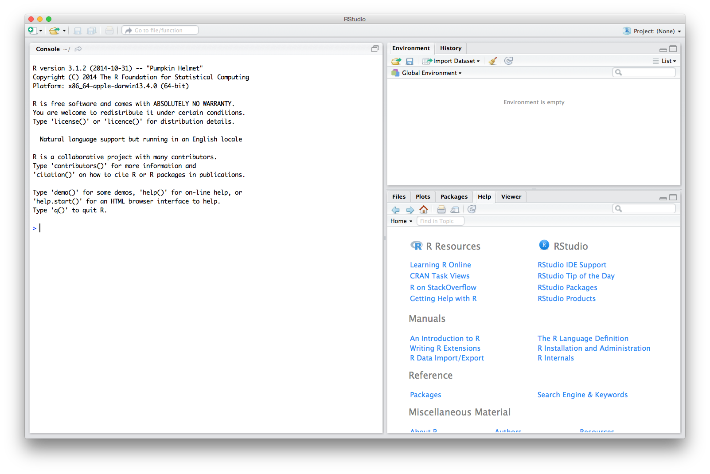
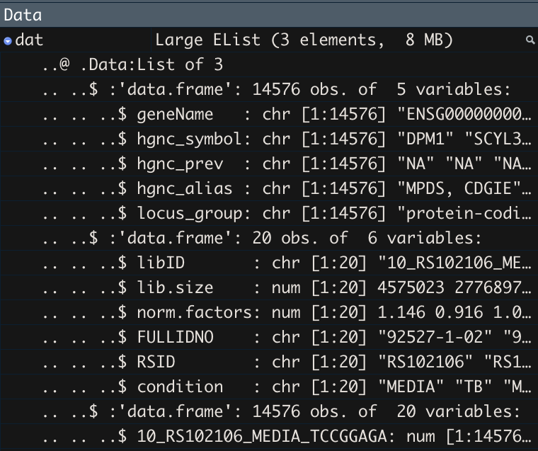

```{r include=FALSE}
knitr::opts_chunk$set(fig.width = 3, fig.height = 3)
```

# Overview
In this workshop, we introduce you to R and RStudio at the beginner level as well as begin to work in the tidyverse. In it, we cover:

* R and RStudio including projects, scripts, and packages
* The help function
* Reading in data as a data frame and RData
* Data types
* Manipulating data in base R and the `tidyverse`
* Plotting with `ggplot2`

We will do all of our work in [RStudio](https://www.rstudio.com/). RStudio is an integrated development and analysis environment for R that brings a number of conveniences over using R in a terminal or other editing environments.

During the workshop, we will build an R script together, which will be posted as 'live_notes' after the workshop [here](https://github.com/hawn-lab/workshops_UW_Seattle/tree/master/2021.06.21_IntroR).

# Prior to the workshop
Please [install R](http://www.r-project.org) and [RStudio](https://www.rstudio.com/products/rstudio/download/). See the [setup instructions](notes/introR_setup.html) for more details.

# A Tour of RStudio
When you start RStudio, you will see something like the following window appear:



Notice that the window is divided into three "panes":

- Console (the entire left side): this is your view into the R engine. You can type in R commands here and see the output printed by R. (To make it easier to tell them apart, your input is printed in blue, while the output is black.) There are several editing conveniences available: use up and down arrow keys to go back to previously entered commands, which can then be edited and re-run; TAB for completing the name before the cursor; see more in [online docs](http://www.rstudio.com/ide/docs/using/keyboard_shortcuts).

- Environment/History (tabbed in upper right): view current user-defined objects and previously-entered commands, respectively.

- Files/Plots/Packages/Help (tabbed in lower right): as their names suggest, these are used to view the contents of the current directory, graphics created by the user, install packages, and view the built-in help pages.

To change the look of RStudio, you can go to Tools -> Global Options -> Appearance and select colors, font size, etc. If you plan to be working for longer periods, we suggest choosing a dark background color scheme to save your computer battery and your eyes.

## RStudio Projects

Projects are a great feature of RStudio. When you create a project, RStudio creates an `.Rproj` file that links all of your files and outputs to the project directory. When you import data, R automatically looks for the file in the project directory instead of you having to specify a full file path on your computer like `/Users/username/Desktop/`. R also automatically saves any output to the project directory. Finally, projects allow you to save your R environment in `.RData` so that when you close RStudio and then re-open it, you can start right where you left off without re-importing any data or re-calculating any intermediate steps.

RStudio has a simple interface to create and switch between projects, accessed from the button in the top-right corner of the RStudio window. (Labeled "Project: (None)", initially.)

#### Create a Project
Let's create a project to work in for this workshop. Start by clicking the "Project" button in the upper right or going to the "File" menu. Select "New Project" and the following will appear.

{width=50%}

You can either create a project in an existing directory or make a new directory on your computer - just be sure you know where it is.

After your project is created, navigate to its directory using your Finder/File explorer. You will see the `.RProj` file has been created. 

To access this project in the future, simply double-click the `RProj` and RStudio will open the project or choose File > Open Project from within an already open RStudio window.

## R Scripts

R script files are the primary way in which R facilitates reproducible research. They contain the code that loads your raw data, cleans it, performs the analyses, and creates and saves visualizations. R scripts maintain a record of everything that is done to the raw data to reach the final result. That way, it is very easy to write up and communicate your methods because you have a document listing the precise steps you used to conduct your analyses. This is one of R's primary advantages compared to traditional tools like Excel, where it may be unclear how to reproduce the results. 

Generally, if you are testing an operation (*e.g.* what would my data look like if I applied a log-transformation to it?), 
you should do it in the console (left pane of RStudio). If you are committing a step to your analysis (*e.g.* I want to apply a log-transformation to my data and then conduct the rest of my analyses on the log-transformed data), you should add it to your R script so that it is saved for future use. 

Additionally, you should annotate your R scripts with comments. In each line of code, any text preceded by the `#` symbol will not execute. Comments can be useful to remind yourself and to tell other readers what a specific chunk of code does. 

Let's create an R script (File > New File > R Script) and save it as `live_notes.R` in your main project directory. If you again look to the project directory on your computer, you will see `live_notes.R` is now saved there.

We will work together to create and populate the `live_notes.R` script throughout this workshop. 

## R packages
#### CRAN

R packages are units of shareable code, containing functions that facilitate and enhance analyses. Let's install `tidyverse`, which is actually a meta-package containing several packages useful in data manipulation and plotting. Packages are typically installed from [CRAN](https://www.r-project.org/) (The Comprehensive R Archive Network), which is a database containing R itself as well as many R packages. Any package can be installed from CRAN using the `install.packages` function. You can input this into your console (as opposed to `live_notes.R`) since once a package is installed on your computer, you won't need to re-install it again.

```{r eval=FALSE}
install.packages("tidyverse", Ncpus=2)
```

**This can take several minutes.**

After installing a package, and *every time* you open a new RStudio session, the packages you want to use need to be loaded into the R workspace with the `library` function. This tells R to access the package's functions and prevents RStudio from lags that would occur if it automatically loaded every downloaded package every time you opened it.

```{r}
# Data manipulation and visualization
library(tidyverse)
```

#### Bioconductor

[Bioconductor](https://www.bioconductor.org/) is another repository of R packages. It has different requirements for upload and houses many of the biology-relevant packages. To install from Bioconductor, you first install its installer from CRAN.

```{r eval=FALSE}
install.packages("BiocManager")
```

Then install your package of choice using it's installer. Here, we install `limma`, a package for analysis of microarray and RNA-seq data.

*If prompted*, say `a` to "Update all/some/none? [a/s/n]" and `no` to "Do you want to install from sources the packages which need compilation? (Yes/no/cancel)"

```{r eval=FALSE}
BiocManager::install("limma")
```

# Getting started

Before doing anything in R, it is a good idea to set your random seed. Your analyses may not end up using a seed but by setting it, you ensure that *everything* is exactly reproducible.

```{r}
set.seed(4389)
```

## Organize data

Create a directory called `data` and move the 2 data files into this directory.

## Loading data into an R
## Data frames from `.csv`, `.tsv`, etc.

One of R's most essential data structures is the data frame, which is simply a table of `m` columns by `n` rows. First, we will read in the RNA-seq metadata into RStudio using the base R `read.table` function.

Each R function follows the following basic syntax, where `Function` is the name of the function.

```
Function(argument1=..., argument2=..., ...)
```

`read.table` has many arguments; however, we only need to specify 3 arguments to correctly read in our data as a data frame. For our data, we will need to specify:

* `file` - gives the path to the file that we want to load from our working directory (current project directory). 
* `sep` - tells R that our data are comma-separated
* `header` - tells R that the first row in our data contains the names of the variables (columns).

We will store the data as an *object* named `meta` using the assignment operator `<-`, so that we can re-use it in our analysis. 

```{r}
# read the data and save it as an object
meta <- read.table(file="data/RSTR_meta_subset.csv", 
                  sep=",", header=TRUE)
```

Now whenever we want to use these data, we simply call `meta`

## Help function

You can read up about the different arguments of a specific function by typing `?Function` or `help(Function)` in your R console.

```{r}
?read.table
```

You will notice that there are multiple functions of the `read.table` help page. This include similar and related functions with additional options. For example, since our data are in `.csv` format, we could've instead read them into R with `read.csv` which assumes the options `sep=",", header=TRUE` by default. 

```{r eval=FALSE}
# read the data with different function
meta <- read.csv(file="data/RSTR_meta_subset.csv")
```

## Complex data from `.RData`

You may have data that do not fit nicely into a single table or into a table at all (like plots). You can save these as `.RData`, which can be loaded directly into R. You can also save multiple tables and/or other objects in a single `.RData` file to make loading your data quick and easy. Moreover, `.RData` are automatically compressed so they take up less storage space than multiple tables.

```{r}
load("data/RSTR_data_clean_subset.RData")
```

Notice that these data appear already named in your R environment as `dat`. Object names are determined when saving so be sure to create short but descriptive names before saving to `.RData`.

See the objects data type with

```{r}
class(dat)
```

# Data types
### Simple

Let's return to the simpler metadata for now. This data frame consists of `r nrow(meta)` rows (observations) and `r ncol(meta)` columns (variables). You can see this quickly using the dimension function `dim`

```{r}
dim(meta)
```

Each column and each row of a data frame are individual R vectors. R vectors are one-dimensional arrays of data. For example, we can extract column vectors from data frames using the `$` operator.

```{r}
# Extract patient IDs
meta$FULLIDNO
```

R objects have several different classes (types). Our data frame contains 2 R data types. The base R `class` function will tell you what data type an object is.

```{r}
class(meta)
class(meta$libID)
class(meta$lib.size)
```

We see that our `libID` column is `character`, meaning it is non-numeric. On the other hand, `lib.size` is `numeric`, meaning a number.

Common data types not found in these data include the following. We will see these later on.

* `factor`: non-numeric value with a set number of unique levels
* `integer`: whole number numeric
* `logical`: TRUE/FALSE designation

### Complex (`S3`, `S4`)

Now, let's look at the `limma EList` data. These data are in `S3` format meaning they have 3 dimensions. In essence, they are a list of multiple data frames and vectors. If you click on the `dat` object in your Environment tab, you will see multiple pieces.

{width=50%}

All 3 pieces are data frames. You can again see this with `class` only this time you specify a part of the `dat` object with `$`

```{r}
class(dat$genes)
class(dat$E)
class(dat$targets)
```

Notice that you get the message `Loading required package: limma`. If you did not have `limma` installed, you could work with these data because they are a data type specific to `limma`.

Or going deeper, you can specify one column in the `genes` data frame

```{r}
class(dat$genes$hgnc_symbol)
```

Of note, working with `S4` objects is very similar to `S3` except that they are accessed with `@` instead of `$`. However, we will not use `S4` in this workshop.

# Working with vectors and data frames
## Operating on vectors

A large proportion of R functions operate on vectors to perform quick computations over their values. Here are some examples:

```{r}
# Compute the variance of library size
var(dat$targets$lib.size)

# Find whether any samples have greater than 10 million sequences
dat$targets$lib.size > 10E6

# Find the unique values of metadata's condition
unique(meta$condition)
```

## Using the correct class

Functions executed on an object in R may respond exclusively to one or more data types or may respond differently depending on the data type. When you use the incorrect data type, you will get an error or warning message. For example, you cannot take the mean of a factor or character.

```{r error=TRUE}
# Compute the mean of libID
mean(meta$libID)
```

## Subsetting vectors and data frames

Since vectors are 1D arrays of a defined length, their individual values can be retrieved using vector indices. R uses 1-based indexing, meaning the first value in an R vector corresponds to the index 1. (Importantly, if you use python, that language is 0-based, meaning the first value is index 0.) Each subsequent element increases the index by 1. For example, we can extract the value of the 5th element of the `libID` vector using the square bracket operator `[ ]` like so.

```{r}
meta$libID[5]
```

In contrast, data frames are 2D arrays so indexing is done across both dimensions as `[rows, columns]`. So, we can extract the same oxygen value directly from the data frame knowing it is in the 5th row and 1st column.

```{r}
meta[5, 1]
```

The square bracket operator is often used with logical vectors (TRUE/FALSE) to subset data. For example, we can subset our metadata to all `MEDIA` observations (rows).

```{r}
# Create logical vector for which lib.size values are > 10 million
logical.vector <- meta$condition == "MEDIA"
#View vector
logical.vector
#Apply vector to data frame to select only observations where the logical vector is TRUE
meta[logical.vector, ]
```

Subsetting is extremely useful when working with large data. We will learn more complex subsets on day 2 using the tidyverse. But first...

## Quick reference: Conditional statements

Statement | Meaning
--------- | -------
`<-`      | Assign to object in environment
`==`      | Equal to
`!=`      | Not equal to
`>`       | Greater than
`>=`      | Greater than or equal to
`<`       | Less than
`<=`      | Less than or equal to
`%in%`    | In or within
`is.na()` | Is missing, *e.g* NA
`!is.na()`| Is not missing
`&`       | And
`|`       | Or

# Exercises: Part 1

1. Install `tidyverse` and `limma` packages.

*Please note that if you have __R v3.3 or older__, you may not be able to install `tidyverse`. In this case, you need to separately install each package within the tidyverse. This includes:* `readr`, `tibble`, `dplyr`, `tidyr`, `stringr`, `ggplot2`, `purr`, `forcats`

2. Using help to identify the necessary arguments for the log function, compute the natural logarithm of 4, base 2 logarithm of 4, and base 4 logarithm of 4.

Using the `meta` data frame:

3. Using an R function, determine what data type the `norm.factors` variable is.
4. Using indexing and the square bracket operator `[]`:
    - determine what `RSID` value occurs in the 20th row
    - return the cell where `lib.size` equals 14509963
5. Subset the data to observations where `RSID` equals "RS102521" or "RS102484". *Hint*: Use a logical vector. 

# RSTR-seq analysis example

The next section will be a targeted analysis of INFG expression in MEDIA vs TB samples. In the process, we will cover some (but not all) functions in the `tidyverse`.

Currently, our data are

`meta`: metadata information including library size, patient ID, and TB condition. Rows are sequencing libraries

```{r echo=FALSE}
meta[1:5,]
```

`dat$genes`: gene information including HGNC symbol and ENSEMBL ID. Rows are genes

```{r echo=FALSE}
dat$genes[1:5, ]
```

`dat$E`: voom normalized log counts per million (CPM). Rows are genes, columns are libraries

```{r echo=FALSE}
dat$E[1:3, 1:3]
```

`dat$targets`: metadata information. This is actually the same as `meta`! We just used `meta` to demonstrate reading in a single table of data.

```{r echo=FALSE}
dat$targets[1:5,]
```

## What is the tidyverse?

The [R tidyverse](https://www.tidyverse.org/) is a set of packages aimed at making, manipulating, and plotting tidy data. Everything we've done thus far has been in base R. Now we will move into the tidyverse!

While base R can accomplish most tasks, base R code is rather slow and can quickly become extremely convoluted. Compared to base R, `tidyverse` code often runs faster. It is also much more readable because all operations are based on using _verbs_ (select, filter, mutate...) rather than base R's more difficult to read indexing system (brackets, parentheses...). 

First, we need to load the package, which will give us a message detailing all the packages this one command loads for us.

```{r}
library(tidyverse)
```

### Common tidyverse functions

Though we will not use all of these in this workshop, here is a list of some commonly used tidyverse functions.

The `dplyr` package provides many functions for manipulating data frames including typical tasks like:

- `select` a subset of variables (columns)
- `filter` out a subset of observations (rows)
- `rename` variables
- `arrange` the observations by sorting a variable in ascending or descending order
- `mutate` all values of a variable (apply a transformation)
- `group_by` a variable and `summarise` data by the grouped variable
- `*_join` two data frames into a single data frame

The `tidyr` package contains functions for manipulating entire data frames including

* `pivot_longer` convert wide to long format
* `pivot_wider` convert long to wide format

## Loading data with readr

The readr functions `read_csv` and `read_tsv` help read in data at quick speeds compared to base R's `read.csv` and `read.tsv` functions. Furthermore, readr's data loading functions automatically parse your data into data types (numeric, character, etc) based on the values in the first 1000 rows. 

Let's start by re-loading in the data we previously loaded with base R's `read.table`.

```{r}
meta <- read_csv(file="data/RSTR_meta_subset.csv")
```

We can then view all the classes it automatically assigned to our variables.

```{r}
spec(meta)
```

You'll see that all our numeric/integer values are now `double`. This is another number class in R that stands for "double precision floating point numbers". Under the hood, `doubles` are more exact than `numeric` and more flexible than `integer`. So, tidyverse preferentially assigns number data to `double`.

Not that there is no tidyverse-specific function for loading `.RData`. You would still load it with `load`.

```{r}
load("data/RSTR_data_clean_subset.RData")
```

## Data wrangling

Our goal is to get the following data frame. When you have multiple (and complex) objects like we have in these data, it is often a good idea to sketch out your goal before beginning the wrangling process.

|libID  | IFNG | FULLIDNO | RSID   |condition|
|-------|------|----------|--------|---------|
|libID1 |  -2  |84222-1-20|RS102051| MEDIA   |
|libID2 |  2   |84222-1-20|RS102051| TB      |

Then we can plot `IFNG` expression in `MEDIA` vs `TB`

### Extract from `S3` object

Our metadata is contained in `meta` or `dat$targets`. For simplicity, let's use `meta` since it's already a separate data frame. This includes everything in our goal data frame except IFNG expression.

### Select columns

We use the tidyverse function `select` to keep a subset of columns of interest. We can either:

list all the columns we want by name

```{r}
meta.sub <- select(.data = meta, 
                   libID, FULLIDNO, RSID, condition)
```

use `:` to list all columns we want between two other columns

```{r}
meta.sub <- select(.data = meta, 
                   libID, FULLIDNO:condition)
```

list all the columns we want to remove by name with `-`

```{r}
meta.sub <- select(.data = meta, 
                   -lib.size, -norm.factors)
```

Note that all our variable names are 1 "word", meaning no spaces or special characters. This is best practices. If you do have messier column names, you need to surround them with `` for R to treat them as column names.

### Filtering rows

Next, we need to get IFNG expression from `dat$E`. First, we extract these data for the `S3` object and convert it to a data frame. (It is actually already a data frame but oftentimes, `S3` limma objects have expression as a `matrix` and this additional step is necessary.)

```{r}
counts <- as.data.frame(dat$E)
```

We then filter the IFNG row.

```{r}
#Move rownames to a variable/column
counts.rowname <- rownames_to_column(counts) 
#filter to keep IFNG only
IFNG <- filter(counts.rowname, rowname == "IFNG")
```

But oh no! Why is our data frame empty?

```{r}
IFNG
```

Let's take a look at the original expression data to find out.

```{r}
counts[1:3,1:3]
```

We see that the gene names are not HGNC symbols (like IFNG), but ENSEMBL gene IDs (ENSG###). Fortunately, our `dat` object contains, `dat$genes`, a key to convert these IDs. This is one of the reasons why we like to store RNA-seq data as an `S3` object!

There are a couple of ways we can get IFNG out of our expression data using the key. For one, we could find out the correct ENSEMBL ID and use it into our `filter` function.

```{r}
IFNG.ID <- filter(dat$genes, hgnc_symbol == "IFNG")

IFNG.ID$geneName

IFNG <- filter(counts.rowname, rowname == "ENSG00000111537")
```

But this isn't very reproducible and requires us to change our code in multiple places if want to look at a different gene later on. We also still only have ENSEMBL ID in our resulting data frame, and this is not a great label for our plots.

### Joining data frames

Instead, we will combine `counts` and `dat$genes` so we have the HGNC symbols in our results data frame.

There are a suite of tidyverse functions for combining two tables, all starting with `join_`. They differ in which rows that keep from each of the two data frames being combined. For example, `left_join` keep all the rows in the left (first) data frame given and removes any rows from the right (second) data frame that do not have matches in the left one. 

A great reference on join functions can be found at <https://stat545.com/join-cheatsheet.html>

Here, we will use `inner_join` which only keeps rows with data in BOTH data frames. For us, this means we only keep data with both `counts` expression data and `dat$genes` key information.

```{r error=TRUE}
genes.counts <- inner_join(counts.rowname, dat$genes)
```

We see any error because tidyverse tries to combine the data based on columns with the same name. And we don't have any!

```{r}
colnames(counts.rowname)
colnames(dat$genes)
```

We could rename a column with `rename` but that's an extra step. Instead, `join_` functions allow you to designate which columns should match.

```{r}
genes.counts <- inner_join(counts.rowname, dat$genes, by=c("rowname"="geneName"))
```

### Filter again

Now we can filter using `hgnc_symbol`

```{r}
IFNG <- genes.counts %>% 
  filter(hgnc_symbol == "IFNG")
```

### Pivot wide to long format

Next, we want to combine `IFNG` and `meta.sub` matching their library IDs. However, library IDs are column names in `IFNG` while they are in 1 single variable `libID` in `meta.sub`.

```{r}
colnames(IFNG)
meta.sub$libID
```

If we transpose `IFNG`, we will have a `libID` variable to match with `meta`. There are several ways to do this including a simple transpose with `t()`. However, this function does not play well with column vs row names and can mess up your data. So, we'll use the tidyverse!

First, we convert the `IFNG` table from wide format (1 row per gene) to long format (1 column per gene). Here, we specify the `IFNG` data frame, the variables we want to collapse (written as all except the gene info with `-c(rowname, hgnc_symbol:locus_group)`), and then the names we want to give the new columns.

Pivoting can be tricky so it is best to *always* look at your table before and after!

```{r}
IFNG[,1:5]

IFNG.long <- pivot_longer(IFNG,
                -c(rowname, hgnc_symbol:locus_group), 
                names_to="libID", values_to="IFNG")

IFNG.long[1:5,]
```

Similarly, `pivot_wider` takes data frames in the other direction from long to wide.

### More joining

Now we can join! Note that here we do not need to use `by` because we've named the new column in `IFNG.long` to match what's in `meta.sub`. The tidyverse prints a message telling us what it joined by so we can be sure it's correct.

```{r}
IFNG.meta <- inner_join(IFNG.long, meta.sub)
```

### More selecting

Finally, we can select just the columns we want, and we have our goal data frame!

```{r}
IFNG.meta.sub <- select(IFNG.meta, libID, IFNG, FULLIDNO, RSID, condition)

head(IFNG.meta.sub)
```

### Piping with `%>%`

At this point, we have quite a few objects in our R environment. And we don't need most of them anymore!

```{r}
ls()
```

Think back to the basic dplyr verb syntax:

- input data frame in the first argument
- other arguments can refer to variables as if they were local objects
- output is another data frame

In our current code, we make a new data frame every time we modify it with a tidyverse verbs. Instead, we can chain commands together using the pipe `%>%` operator. This works nicely to condense code and to improve readability.

`f(x) %>% g(y)` is the same as `g(f(x),y)`

`select(meta, libID)` is the same as `meta %>% select(libID)`

Let's return to our `dat$E` data and perform all the above wrangling in 1 piped function. Note how I've added comments within the function to aid the reader.

```{r}
meta.sub <- select(.data = meta, 
                   libID, FULLIDNO, RSID, condition)

IFNG <- as.data.frame(dat$E) %>% 
  #Move rownames to a column. Unlike before, let's name it 
  #to match what we'll be joining with next
  rownames_to_column("geneName") %>% 
  #Join with gene key to get HGNC symbol
  inner_join(dat$genes) %>% 
  #filter IFNG expression
  filter(hgnc_symbol == "IFNG") %>% 
  #Pivot to long format so can combine with metadata
  pivot_longer(-c(geneName, hgnc_symbol:locus_group), 
                names_to="libID", values_to="IFNG") %>% 
  #join with library metadata
  inner_join(meta.sub) %>% 
  #select variables of interest
  select(libID, IFNG, FULLIDNO, RSID, condition)

head(IFNG)
```

## Graphics with ggplot2

ggplot2 is the tidyverse's main plotting package. Full documentation is available at
[docs.ggplot2.org](http://docs.ggplot2.org/current/)

### Why ggplot?

ggplot2 is an implementation of _Grammar of Graphics_ (Wilkinson 1999) for R

Benefits:

- handsome default settings
- snap-together building block approach
- automatic legends, colors, facets
- statistical overlays: regressions lines and smoothers (with confidence intervals)

Drawbacks:

- it can be hard to get it to look *exactly* the way you want
- requires having the input data in a certain format

### ggplot building blocks

- data: 2D table (`data.frame`) of _variables_
- _aesthetics_: map variables to visual attributes (e.g., position)
- _geoms_: graphical representation of data (points, lines, etc.)
- _stats_: statistical transformations to get from data to points in
the plot(binning, summarizing, smoothing)
- _scales_: control _how_ to map a variable to an aesthetic
- _facets_: juxtapose mini-plots of data subsets, split by variable(s)
- _guides_: axes, legend, etc. reflect the variables and their values

Idea: independently specify and combine the blocks to create the plot you want.

There are at least three things we have to specify to create a plot:

1. data
2. aesthetic mappings from data variables to visual properties
3. a layer describing how to draw those properties

### Boxplot

We will start with a boxplot of our data with the TB condition on X and gene expression on Y.

```{r}
ggplot(IFNG, aes(x=condition, y=IFNG)) +
  geom_boxplot()
```

### Multiple geoms

The building block nature of ggplot allows us to add multiple geoms on top of each other. So we can include individual dots for each sample with `geom_point` to see the sample sizes within each boxplot.

```{r}
ggplot(IFNG, aes(x=condition, y=IFNG)) +
  geom_boxplot() +
  geom_point()
```

But some points overlap so we switch to `geom_jitter` to spread them out. Setting the jitter height to 0 ensures that the perceived y values are correct for these data.

```{r}
ggplot(IFNG, aes(x=condition, y=IFNG)) +
  geom_boxplot() +
  geom_jitter(width = 0.2, height=0) 
```

And while this is not an issue in this plot (since there are no outliers), you should also remove the outliers plotted by `geom_boxplot` or else there will be duplicate points with `geom_jitter`.

```{r}
ggplot(IFNG, aes(x=condition, y=IFNG)) +
  geom_boxplot(outlier.shape=NA) +
  geom_jitter(width = 0.2, height=0) 
```

### Further beautification

Below are just a couple other tricks to perfect this plot.

```{r message=FALSE}
ggplot(IFNG,
       #Define x and y variables
         aes(x=condition, y=IFNG)) +
  #Create boxplots
  ## Set the outlier shape to NA so that you don't get duplicate
  ## dots in the next layer.
  geom_boxplot(outlier.shape=NA) +
  #Add points for each sample. Color by MEDIA/TB and "jitter" left 
  # and right (width) to avoid overlap
  geom_jitter(aes(color=condition), width = 0.2, height=0) +
  #Format axis labels
  labs(y="IFNG normalized log2 expression", x="") + 
  #Change theme to classic to remove grey background and other
  #default aspects of ggplot
  theme_classic()+
  #Remove legend since it's redundant
  theme(legend.position = "none") 
```

### Complex plots
#### Facets

A quick way to make a lot of plots is with facets. The power of facets is harnessed by combining tidyverse pipes with `ggplot`. Here, go all the way back to beginning and instead keep expression from 2 genes. We don't save the resulting data as an object in the environment but instead, pipe the modified data directly into ggplot.

```{r message=FALSE}
as.data.frame(dat$E) %>% 
  #Move rownames to a column. Unlike before, let's name it 
  #to match what we'll be joining with next
  rownames_to_column("geneName") %>% 
  #Join with gene key to get HGNC symbol
  inner_join(dat$genes) %>% 
  #filter IFNG and TNF expression
  filter(hgnc_symbol %in% c("IFNG", "IFNA1")) %>% 
  #Pivot to long format so can combine with metadata
  pivot_longer(-c(geneName, hgnc_symbol:locus_group), 
                names_to="libID", values_to="expression") %>% 
  #join with library metadata
  inner_join(meta.sub) %>% 
  #select variables of interest. Note we need to keep hgnc_symbol to tell
  #data from the two genes apart
  select(libID, hgnc_symbol, expression, FULLIDNO, RSID, condition) %>% 
 
  ggplot(aes(x=condition, y=expression)) +
  #Create boxplots
  ## Set the outlier shape to NA so that you don't get duplicate
  ## dots in the next layer.
  geom_boxplot(outlier.shape=NA) +
  #Add points for each sample. Color by MEDIA/TB and "jitter" left 
  # and right (width) to avoid overlap
  geom_jitter(aes(color=condition), width = 0.2, height=0) +
  #Format axis labels
  labs(y="Normalized log2 expression", x="") + 
  #Change theme to classic to remove grey background and other
  #default aspects of ggplot
  theme_classic() +
  #Remove legend since it's redundant
  theme(legend.position = "none") +
  #Add facet
  facet_wrap(~hgnc_symbol)
```

Note that here, our X and Y scales are similar but facets allow you to vary scales with the `scales` parameter within `facet_wrap`.

## Cautions with these data
#### Duplicates

In this workshop, we've worked with a small subset of these data. In the full data set, there are two types of sample duplicates. 

1. Paired MEDIA and TB samples
    - If you do a statistical analysis with both conditions, your model needs to block by sample (RSID) to take into account the experimental design. This can be done with the package `lme4`. See this past workshop for examples <https://github.com/hawn-lab/workshops_UW_Seattle/tree/master/2020.05.12_linear_models>

2. There are multiple samples (RSID) for some individuals (FULLIDNO). If these exist in the subset of data you are interested in, your model needs to take this into account OR you should choose 1 RNA-seq sample per individual.

# Exercises: Part 2

1. Modify the plotting code to visualize your gene of choice.

2. Using a new ggplot function, `scale_color_manual`, change the colors in your plot.

3. Using `IFNG` and a new tidyverse verb, `mutate`,  convert expression values out of log2 scale to just "normalized expression". Are expression changes more or less apparent in a plot of non-log2 data?

# Additional resources
## Groups

* [Rladies Seattle](https://www.meetup.com/rladies-seattle/) Not just for ladies! A pro-actively inclusive R community with both in-person and online workshops, hangouts, etc.
* [TidyTuesday](https://github.com/rfordatascience/tidytuesday) A weekly plotting challenge
* [R code club](https://www.riffomonas.org/code_club/) Dr. Pat Schloss opened his lab's coding club to remote participation. 
* [Seattle useR Group](https://www.meetup.com/Seattle-useR/)

## Online

* [R cheatsheets](https://www.rstudio.com/resources/cheatsheets/) also available in RStudio under Help > Cheatsheets
* [The Carpentries](https://carpentries.org/)

* [Introduction to dplyr](https://cran.r-project.org/web/packages/dplyr/vignettes/dplyr.html)
* [dplyr tutorial](https://rpubs.com/justmarkham/dplyr-tutorial)
* [dplyr video tutorial](https://www.r-bloggers.com/hands-on-dplyr-tutorial-for-faster-data-manipulation-in-r/)
* [More functions in dplyr and tidyr](https://rpubs.com/bradleyboehmke/data_wrangling)

* [ggplot tutorial 1](http://r-statistics.co/Complete-Ggplot2-Tutorial-Part1-With-R-Code.html)
* [ggplot tutorial 2](https://rpubs.com/g_jw/ggplot2_tutorial)
* [ggplot tutorial 3](http://tutorials.iq.harvard.edu/R/Rgraphics/Rgraphics.html#the_1_faq)

# R session

```{r}
sessionInfo()
```

***